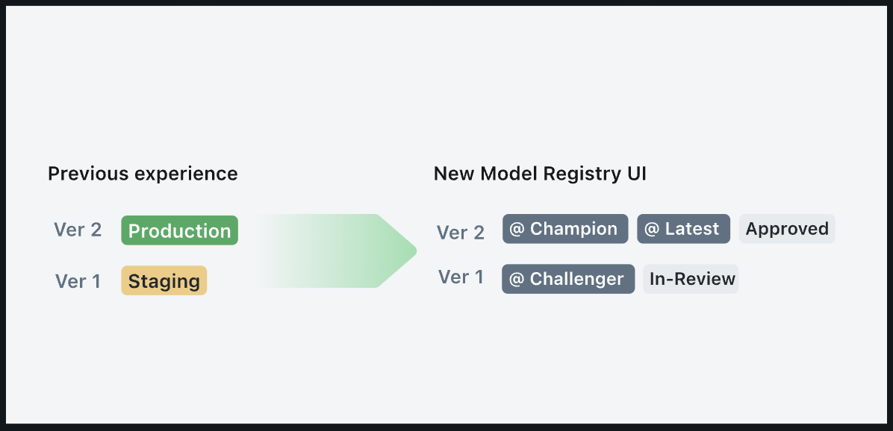
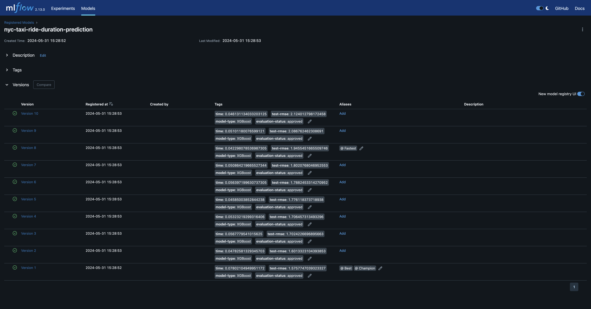

## 2.5 Model Registry
How can you take a model and run it in a production environment?
But if you're updating a model, what do you need to change?
* Update of hyperparameters?
* Any new preprocessing?
* New set of dependencies?

What we need to do is create a safe set of versions etc.

Using the [Model Registry](https://mlflow.org/docs/latest/model-registry.html) allows us to safely and simply switch between different models we want to implement, and rollback if needed. You can also keep staging, prod, and archive versions separate too.

Typically what happens is the data scientist will upload  amodel to the Model Registry, then the MLOps engineer can assess whether the model is appropriate to go into staging, prod, archive etc.

NB this doesn't actually deploy the model it just stores them and helps you decide which ones to deploy.

E.g. evaluate: Training time, memory size, rmse, prediction time.

### 2.5.1 Registering your model
Once you've selected the model which you want to register, click the `Register Model` button. You will be prompted to enter a model name (or select which model to store the run under). Once done the `Register Model` button will be replaced by a link to the registered model.

Then navigate to the "Models" tab then you can click and select whichever versions you want. These will also be linked to the run etc. Futhermore you can add/remove/edit tags.

You can then move model versions into staging/prod/archive.

Then the deployment engineer will look and decide which one to run

### 2.5.2 MLClient class

    from mlflow.tracking import MLflowClient

    MLFLOW_TRACKING_URI = "sqlite:///mlflow.db"
    client = MlfowClient(tracking_uri=MLFLOW_TRACKING_URI)

The [client](https://mlflow.org/docs/latest/python_api/mlflow.client.html?highlight=mlflow%20client#module-mlflow.client) module provides an interfact to Experiemtns, Runs, Model Versions and Registered Models.

NB This is a lower level version of the `mlflow module` which is used for active runs.

For example,

* `client.search_experiments()`: Returns the experiments stored in the database. NB These are in a paged list so filters can be chosen this way. [Documentation](https://mlflow.org/docs/latest/python_api/mlflow.html?highlight=search_experiments#mlflow.search_experiments)

    ```
    #View all experiments
    Experiments = client.search_experiments()
    for exp in Experiments:
        print(f"Experiment#: {exp.experiment_id}, Experiment Name: {exp.name}")
    ```
* `client.search_runs()`: find the runs you want. [Documentation](https://mlflow.org/docs/latest/python_api/mlflow.client.html?highlight=client%20search_runs#mlflow.client.MlflowClient.search_runs)

    ```
    from mlflow.entities import ViewType

    #Select your chosen experiment
    Exp_id = Experiments[0].experiment_id
    Exp_name = Experiments[0].name
    #Get the runs for this experiment
    runs = client.search_runs(
        experiment_ids = Exp_id,
        filter_string = "",
        run_view_type = ViewType.ACTIVE_ONLY,
        max_results = 10,
        order_by = ["metrics.val_rmse ASC"]
        )
    for run in runs:
        print(f"run_id: {run.info.run_id}, val_rmse: {run.data.metrics['val_rmse']}")
    ```

**Essentially the client is interacting with the database to get the values via python**.

### 2.5.3 Promoting Models

#### 2.5.3.1 Registering models programatically
Just simply type the code below in. However, in this case a model is one theat performs a function and there are versions of the model which correlate to the runs stored. 

    ```
    import mlfow

    TRACKING_URI = "<Enter your URI here>"
    mlfow.set_tracking_uri(TRACKING_URI)

    run_id = "<Enter run id here>"
    model_run_uri = f"runs:/{run_id}/model"
    mlflow.register_model(model_uri=model_uri, name="nyc-taxi-regressor")
    ```

#### 2.5.3.2 Transitioning Models programatically

The old way was to have two main stages `Staging` and `Production` however as of v2.9.0 of MLflow staging is being eased out and instead model versioning tags have been elevated.



MLflow is transitioning away from stages and elevating aliasing. From my reading this means that aliases are to be used when there is only one model, while tags are to be used when multiple models are to be used. In this notebook I'm providing the following

| Aliases | Tags |
|---------|------|
| `Champion`: The best performing model in the test data. | `model-type`: The type of model it is | 
| `Fastest`: This is the fastest resgistered model. | `evaluation-status: ____`: The status of whether it it pending/approved/failed.|
| `Best`: This is the most/accurate model regardless of time. | `archived`: This model is to be archived. 
|`Production`: The model currently in production | `rmse: _____`: The rmse score for the model. |
|`Previous`: The previous model version in production.| 
|`Staging`: The model used in the staging environment.| 
  
  
##### Transitioning the old way

    model_name = "nyc-taxi-regressor"
    latest_versions = client.get_latest_versions(name=model_name)

    for version in latest_versions:
        print(f"Version: {version.version}, Stage: {version.current_stage})

    model_version = 4
    new_stage = "Staging"

    client.transition_model_version_stage(
        name = model_name,
        version = model_version,
        stage = new_stage,
        archive_existing_versions = False
    )
##### New way

In this way I'm going to evaluate the 10 selected models and programatically use Aliasing to select the best performing one. In my estimations this is a combination of both speed and accuracy. While this can be calculated in a more elegant manner I've picked the simple `rmse / time` where the smaller the value the better. You can see the code snippet below for how I chose tags and aliases. NB Bear in mind MLflow does not do zero-indexing so you will have to edit this yourself.
    
    import time

    Champ_Version = 1
    Fastest_Version = 1
    Best_Version = 1
    Champ_metric = float('inf')
    Fastest_Time = float('inf')
    Best_rmse = float('inf')

    #Create a model
    MLFLOW_TRACKING_URI = "sqlite:///mlflow.db"
    mlflow.set_tracking_uri(MLFLOW_TRACKING_URI)
    client = mlflow.tracking.MlflowClient(tracking_uri=MLFLOW_TRACKING_URI)
    Model_Name = "nyc-taxi-ride-duration-prediction"


    for i in range(len(runs)):
        #Register Version
        run_id = runs[i].info.run_id
        model_run_uri = 'runs:/'+ run_id +'/model'
        mlflow.register_model(model_uri=model_run_uri, name=Model_Name)

        model = mlflow.pyfunc.load_model(model_run_uri)
        run_dict = runs[i].to_dictionary()

        start_time = time.time()
        y_pred = model.predict(X_test)
        end_time = time.time()

        code_duration = end_time - start_time
        test_rmse = mean_squared_error(y_test.to_numpy(), y_pred, squared=False)
        eval_metric = test_rmse / code_duration

        if eval_metric < 100:
            status = "approved"
        else:
            status = "failed"
        #Apply tags
        client.set_model_version_tag(name=Model_Name, version=i+1, key='time', value=code_duration)
        client.set_model_version_tag(name=Model_Name, version=i+1, key='test-rmse ', value=test_rmse)
        client.set_model_version_tag(name=Model_Name, version=i+1, key='model-type ', value=run_dict['data']['tags']['model'])
        client.set_model_version_tag(name=Model_Name, version=i+1, key='evaluation-status ', value=status)
        
        #Comparisons for aliases
        if code_duration < Fastest_Time:
            Fastest_Time = code_duration
            client.set_registered_model_alias(name=Model_Name, alias="Fastest", version=i+1)
            Fastest_Version = i
        if eval_metric > Champ_metric:
            Champ_metric = eval_metric
            client.set_registered_model_alias(name=Model_Name, alias="Champion", version=i+1)
            Champ_Version = i
        if test_rmse < Best_rmse:
            Best_rmse = test_rmse
            client.set_registered_model_alias(name=Model_Name, alias="Best", version=i+1)
            Best_Version = i

    print(f"Champion is version {Champ_Version}, with an eval_metric of {eval_metric: .3f}")
    print(f"Fastest is version {Fastest_Version}, with an prediction duration of {code_duration: .3f}")
    print(f"Best is version {Champ_Version}, with a rmse of {test_rmse: .3f}")

When you naviagate back to the MLflow UI you should see something similar to the screenshot below. Where Version 1 is both the `best` and the `champion` version. 



#### 2.5.3.3 Annotating models
Means of adding a description to the model has not changes. For example add when the model was transitioned
    ```
    from datetime import datetime
    
    date = datetime.today().date()
    client.update_model_version(
        name = model_name,
        version = model_version,
        description = f"The model version {model_version} was transitioned to {new_stage} on {date}
    )
    ```

#### 2.5.3.4 Test run of the model
    
You can set up a simple run of the model to check that it is working e.g. these functions

    from sklearn.metrics import mean_squared_error
    import pandas as pd


    def read_dataframe(filename):
        df = pd.read_csv(filename)

        df.lpep_dropoff_datetime = pd.to_datetime(df.lpep_dropoff_datetime)
        df.lpep_pickup_datetime = pd.to_datetime(df.lpep_pickup_datetime)

        df['duration'] = df.lpep_dropoff_datetime - df.lpep_pickup_datetime
        df.duration = df.duration.apply(lambda td: td.total_seconds() / 60)

        df = df[(df.duration >= 1) & (df.duration <= 60)]

        categorical = ['PULocationID', 'DOLocationID']
        df[categorical] = df[categorical].astype(str)
        
        return df


    def preprocess(df, dv):
        df['PU_DO'] = df['PULocationID'] + '_' + df['DOLocationID']
        categorical = ['PU_DO']
        numerical = ['trip_distance']
        train_dicts = df[categorical + numerical].to_dict(orient='records')
        return dv.transform(train_dicts)


    def test_model(name, stage, X_test, y_test):
        model = mlflow.pyfunc.load_model(f"models:/{name}/{stage}")
        y_pred = model.predict(X_test)
        return {"rmse": mean_squared_error(y_test, y_pred, squared=False)}


Then simply download your test data, preprocessor, and model.

    # Load in your data
    df = read_dataframe("data/green_tripdata_2021-03.csv")
    
    # Download the preprocessor
    client.download_artifacts(run_id=run_id, path='preprocessor', dst_path='.')
    
    import pickle

    with open("preprocessor/preprocessor.b", "rb") as f_in:
        dv = pickle.load(f_in)
    
    # Preprocess your test data
    X_test = preprocess(df, dv)

    # Set your target values
    target = "duration"
    y_test = df[target].values

    # Evaluate Staging vs Production models
    print("Existing Model Version: ...)
    %time test_model(name=model_name, stage="Production", X_test=X_test, y_test=y_test)

    print("Staging Model Version: ...")
    %time test_model(name=model_name, stage="Staging", X_test=X_test, y_test=y_test)

From this if it is better you can transition the model to prod.

    model_version = 4
    new_stage = "Production"

    client.transition_model_version_stage(
        name = model_name,
        version = model_version,
        stage = new_stage,
        archive_existing_versions = False
    )

Or you can simply add in the code snippet I did earlier with the Aliasing and Tagging
