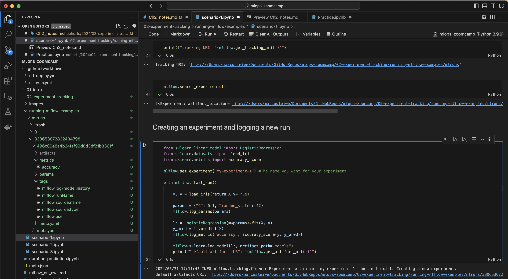

## 2.6 MLflow in Practice
Each scenario will different requirements

* Single Data Scientist participating in an ML competition
    * Can store everything locally.
    * Sharing between others is not necessary.
    * No model registry needed because the model isn't going to deployment.

* A Cross-functional team with one Data Scientist working on an ML model
    * Need to share the exp information.
    * No specific need to run the trafficking server remotely. It might be ok to be run on the local computer.
    * Using the model registry would probably be a good idea (remotely/locally).

* Multiple Data Scientists working on multiple models
    * Here collaboration is vital.
    * Remote tracking is vital, as multiple people will contribute to a single experiment.
    * The model registry will be vital.

These three examples will serve as examples for each situation. And your MLflow set up will change depending what your needs are.But broadly there are three things you need to consider

* `Backend Store`: Where MLflow stores all the metadata. NB by default it will store it locally
    * Local file system:
    * SQLAlchemy compatible database (e.g. SQLite)

* `Artifact Storage`: Images, model, etc. Default is locally
    * Store artifacts locally?
    * Remotely (e.g. S3 bucket)

* `Tracking Server`: The mlflow ui etc. to capture the data. If you are just working on your own this is probably not necessary
    * None
    * Localhost
    * Remote

### 2.6.1 Scenario 1: Single Data Scientist
Here everything will be stored locally with no need for a tracking server. You can see the demo in the notebook below
[Single Data Scientist Notebook](../../../02-experiment-tracking/running-mlflow-examples/scenario-1.ipynb)

#### 2.6.1.1 Set up
```
import mlflow
```

No `tracking URI` will be provided as the default assumption is that if not specified the data is stored locally. If you want to see the tracking server you can use.

```
mlflow.get_tracking_uri()
```
This will show where the data is stored (Default is current directory + mlruns, i.e. `./mlruns`). *NB it will only create the folder mlruns once an experiment is set up*.

To see the experiments stored use. NB There will always be a default experiment, and if the experiment is not specified it will be associated with the default one (Usually in a folder `0`).
```
mlflow.search_experiments() #NB `list_experiments` is depreciated and doesn't work anymore
```
#### 2.6.1.2 Creating an experiment and logging a new run

Here we can just run the simple cell here and the data should be logged
```
from sklearn.linear_model import LogisticRegression
from sklearn.datasets import load_iris
from sklearn.metrics import accuracy_score

mlflow.set_experiment("my-experiment-1") #The name you want for your experiment

with mlflow.start_run():

    X, y = load_iris(return_X_y=True)

    params = {"C": 0.1, "random_state": 42}
    mlflow.log_params(params)

    lr = LogisticRegression(**params).fit(X, y)
    y_pred = lr.predict(X)
    mlflow.log_metric("accuracy", accuracy_score(y, y_pred))

    mlflow.sklearn.log_model(lr, artifact_path="models")
    print(f"default artifacts URI: '{mlflow.get_artifact_uri()}'")
```
If you look across to the file explorer you can see the data there


#### 2.6.1.3 Interact with the model registry
This will be impossible as we have not set it up.

```
from mlflow.exceptions import MlflowException

try:
    client.list_registered_models()
except MlflowException:
    print("It's not possible to access the model registry :(")
```
This should return the error message, as not tracking server is set up.

NB If you want to run the `mlflow ui` command make sure you navigate to the correct folder as mlflow will search the current directory for a folder titled `mlruns` by default.

### 2.6.2 Scenario 2: A cross-functional team with one data scientist working on an ML model
[Scenario 2 notebook](../../../02-experiment-tracking/running-mlflow-examples/scenario-2.ipynb)
MLflow setup:
- tracking server: yes, local server
- backend store: sqlite database
- artifacts store: local filesystem

The experiments can be explored locally by accessing the local tracking server.

To run this example you need to launch the mlflow server locally by running the following command in your terminal:

`mlflow server --backend-store-uri sqlite:///backend.db --default-artifact-root ./artifacts_local`

`--default-artifact-root`: Is used to specify where you want to save the artifacts.

Once this has been run you can copy and paste the listening port across into your browser to interact with the MLflow UI.

NB The metadata will be stored in the database.

### 2.6.3 Scenario 3: Multiple Data Scientists working on multiple ML models
This is a more complicated set up compared to the other too
[Scenario 3 notebook](../../../02-experiment-tracking/running-mlflow-examples/scenario-3.ipynb)

MLflow setup:
* Tracking server: yes, remote server (EC2).
* Backend store: postgresql database.
* Artifacts store: s3 bucket.

The experiments can be explored by accessing the remote server.

The exampe uses AWS to host a remote server. In order to run the example you'll need an AWS account. Follow the steps described in the file [mlflow_on_aws.md](../../../02-experiment-tracking/mlflow_on_aws.md) to create a new AWS account and launch the tracking server.

NB EC2 and RDS are within the free tier so you won't be charged.
